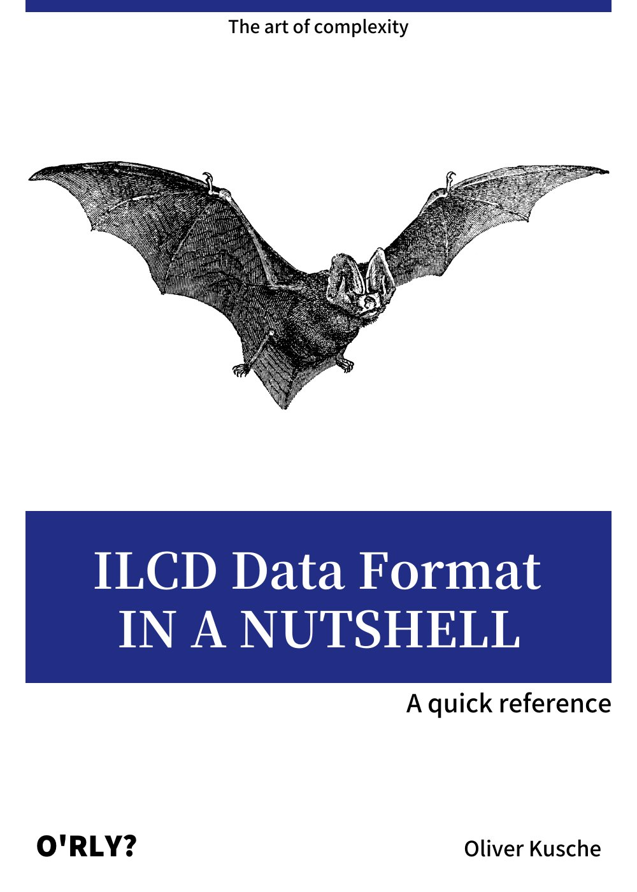
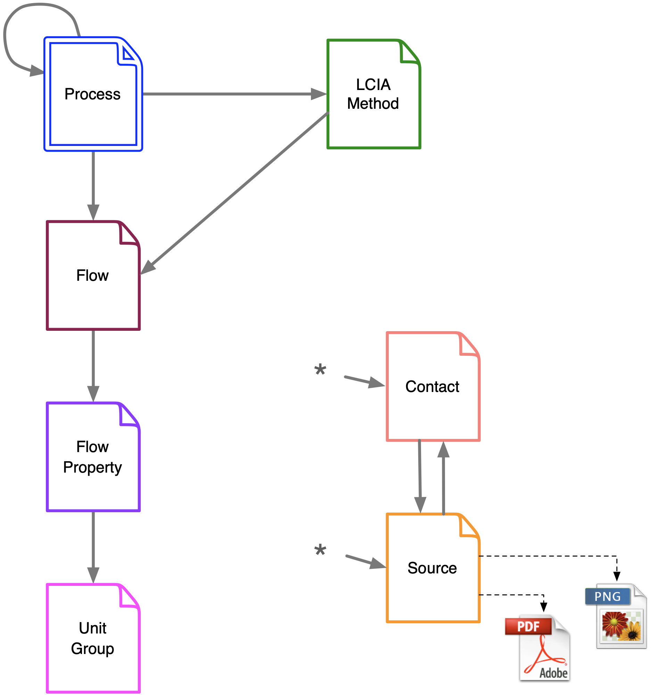
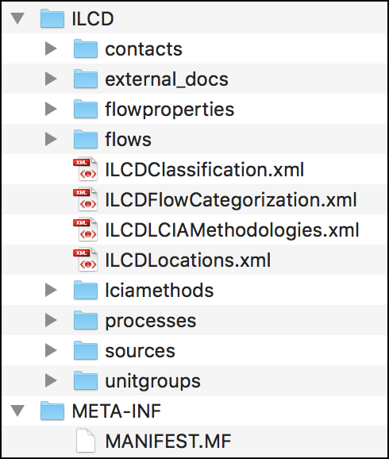
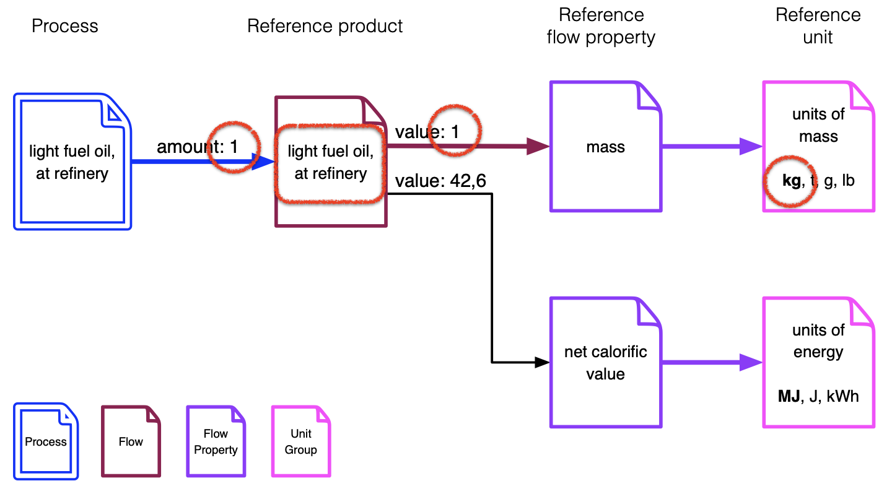

# ILCD Data Format in a nutshell

## Introduction

This guide is targeted at developers who want to add support for the ILCD data format to their application. A basic understanding for XML constructs such as elements, attributes, namespaces etc. as well as XPath expressions is assumed.

## 📕 Specification and documentation

Direct online access to the individual specification documents for the individual dataset types can be found from this page:

https://eplca.jrc.ec.europa.eu/LCDN/developerILCDDataFormat.xhtml

On the bottom part of the page, you'll also be able to download the full Software Developer Kit (SDK) which contains all XML Schemas, examples as well as the documentation mentioned above.

Note: The only difference between the two available variants "eILCD Data Format SDK" and "ILCD Data Format SDK" are that the eILCD version contains the additional specification and examples for the new Life Cycle Model dataset type which has been added later.

## 🗂 Object oriented structure

The ILCD format is based on an object-oriented approach. In order to model information about LCA data, there are seven data set types: 

- *Process* for modelling both unit and aggregated processes. Input and output flows are modelled by references to data sets of type *Flow*. May optionally contain results of an impact assessment, in this case data sets of type *LCIA Method* will be referenced.
- *Flow* describes an elementary, product or waste flow. It references one or more *Flow Property* data sets.
- *Flow Property* (quantity) describes physical or other properties of a flow that can be used to quantify it, for example mass or gross calorific value.
- *Unit Group* (dimension) describes a group of convertible units and the conversion factors to its reference unit.
- *LCIA Method* describes an LCIA method and its characterisation factors e.g.an impact category like global warming potential or ecotoxicity. The data set can also document an entire methodology. The data set references one *Flow Property* data set, that identifies the quantity of the characterisation factors and thereby their dimension.
- *Source* represents an external source of information, such as literature or a database or data format. It can contain a reference to an external binary file (such as a PDF document or PNG image) or resource as well. It can reference a contact it is related to.
- *Contact* describes a person or organisation. It can itself again reference another contact, allowing to document hierarchical relationships (e.g. person working group organisation).

With this principle, object instances can be reused and simply referenced multiple times. For example, if two process datasets have been reviewed by the same person, there is only one contact dataset instance describing the reviewer which is referenced by both process datasets.

### 🪪 Identification

Each of these objects (datasets) is uniquely identified by a UUID and a version number.

### 🔗 References

References between datasets (objects) are made by pointing to the target object using its dataset type, UUID and version number or, alternatively, a URL. 

The possible references between the dataset types can be seen in the diagram below.

## 📦 ZIP archives

In order to transfer a set of these objects together, they can be packaged into a ZIP archive with a specific structure. On the root level, there must be a folder `ILCD`, inside which there are separate folders for each dataset type which contain the corresponding datasets as XML documents.

The folder `external_docs` contains any binary attachments of source datasets (such as PDF documents or images).

## 📡 Communicating w/REST end points

In case the datasets to be read are residing on a soda4LCA instance, here are the basics for retrieving them via the API.
The full API docs can be found [here](https://bitbucket.org/okusche/soda4lca/src/7.x-branch/Doc/src/Service_API/Service_API.md).

### Base URL

The base URL of a node consists of the server address and the suffix `/resource/`, e.g.

`https://weee-lci.ecosystem.eco/resource/`

### Retrieving a list of available process datasets

The end point for retrieving a list of available process datasets is `/processes`:

`https://weee-lci.ecosystem.eco/resource/processes`  [[try it]](https://weee-lci.ecosystem.eco/resource/processes)

This will return a result set in XML representation, which alternatively is also available in JSON form:

`https://weee-lci.ecosystem.eco/resource/processes?format=json`  [[try it]](https://weee-lci.ecosystem.eco/resource/processes?format=json)

The result list is paginated, the page can be controlled by the `startIndex` and `pageSize` GET parameters:

`https://weee-lci.ecosystem.eco/resource/processes?startIndex=20&pageSize=5`  [[try it]](https://weee-lci.ecosystem.eco/resource/processes?startIndex=20&pageSize=5)

### Data stocks

To retrieve a list of available process datasets from a specific data stock, the UUID of the data stock can be specified in the path:

`https://weee-lci.ecosystem.eco/resource/datastocks/47dd81b4-5679-4084-8ef5-2ac269afeb03/processes`  [[try it]](https://weee-lci.ecosystem.eco/resource/datastocks/47dd81b4-5679-4084-8ef5-2ac269afeb03/processes)

A list of available data stocks can be retrieved using the `/datastocks` end point:

`https://weee-lci.ecosystem.eco/resource/datastocks`  [[try it]](https://weee-lci.ecosystem.eco/resource/datastocks)

### Query parameters

To find process datasets matching specific criteria, such as keywords in name or description, location, reference year etc., a number of query parameters are supported. The following will return all process datasets containing "ABS" in the name:

`https://weee-lci.ecosystem.eco/resource/datastocks/47dd81b4-5679-4084-8ef5-2ac269afeb03/processes?search=true&name=ABS`  [[try it]](https://weee-lci.ecosystem.eco/resource/datastocks/47dd81b4-5679-4084-8ef5-2ac269afeb03/processes?search=true&name=ABS)

See [here](https://bitbucket.org/okusche/soda4lca/src/4d11d8f048eb745c5b3d154e36e17fb4a22f7bea/Doc/src/Service_API/Service_API_Datasets_Process_Query.md) for the full list of supported query parameters.

### Retrieving a process dataset

A single process dataset can be retrieved in its original XML representation by following the link `@xlink:href` attribute on the specific entry from the query result set and adding a `format=xml` GET parameter:

`https://weee-lci.ecosystem.eco/resource/processes/7c805d5b-071e-4633-856d-24682db24bd1?version=01.00.000&format=xml`  [[try it]](https://weee-lci.ecosystem.eco/resource/processes/7c805d5b-071e-4633-856d-24682db24bd1/zipexport?version=01.00.000&format=xml)

This will return the original unmodified dataset as published.

Alternatively, a JSON representation is available generated by the server:

`https://weee-lci.ecosystem.eco/resource/processes/7c805d5b-071e-4633-856d-24682db24bd1?version=01.00.000&format=json`  [[try it]](https://weee-lci.ecosystem.eco/resource/processes/7c805d5b-071e-4633-856d-24682db24bd1?version=01.00.000&format=json)

There is also an extended view which will already resolve the references to some of the dependencies and render the information inline, making some more relevant information e.g. for the reference product already available:

`https://weee-lci.ecosystem.eco/resource/processes/7c805d5b-071e-4633-856d-24682db24bd1?version=01.00.000&format=json&view=extended`  [[try it]](https://weee-lci.ecosystem.eco/resource/processes/7c805d5b-071e-4633-856d-24682db24bd1?version=01.00.000&format=json&view=extended)

(Note: this currently works only for the reference product(s).)

### Retrieving a process dataset with dependencies

A specific process dataset with all its dependencies can be downloaded as an ILCD ZIP archive with the `/zipexport´ end point:

`https://weee-lci.ecosystem.eco/resource/processes/7c805d5b-071e-4633-856d-24682db24bd1/zipexport?version=01.00.000`  [[try it]](https://weee-lci.ecosystem.eco/resource/processes/7c805d5b-071e-4633-856d-24682db24bd1/zipexport?version=01.00.000)

## 📖 Reading the format

The dataset type we'll typically be dealing with when looking for LCA information is the *Process* dataset. It consists of a metadata section, an optional exchanges section (for the inventory) and an optional LCIA results section.

### Metadata

#### 🪪 Name

- basename etc.

#### ⏳ Time representativity

We'll usually be interested in the reference year and the valid until year. 

#### 🌍 Geographical representativity

#### 🏭 Technological representativity

#### 👨‍⚖️ Compliance

The declarations in the Compliance section indicate what compliance system(s) the dataset is compliant to. Compliance systems are represented by *Source* datasets identified by their respective UUID. A compliance system may also define a reference list of elementary flows (nomenclature). The following table lists some of the most relevant compliance systems:

| Compliance system             | Short name | dn*  | Source dataset UUID                  |
| ----------------------------- | ---------- | ---- | ------------------------------------ |
| ISO 14040                     | ISO 14040  | no   | 1ea48531-e397-4ca7-ac08-056e4fa11826 |
| ISO 14044                     | ISO 14044  | no   | 1adb438d-4a8b-4919-885e-0a66da3c0f2a |
| ILCD Entry Level              | ILCD EL    | yes  | d92a1a12-2545-49e2-a585-55c259997756 |
| Environmental Footprint 2.0   | EF 2.0     | yes  | c2633e08-f120-4def-b761-a63acbd75d8c |
| Environmental Footprint 3.0   | EF 3.0     | yes  | 3f5b0b56-60e6-4df7-869d-a811830386d9 |
| Environmental Footprint 3.1   | EF 3.1     | yes  | 0eb2b770-2cb1-43cf-9fbc-215df36fe9f0 |
| Environmental Footprint 4.0** | EF 4.0     | yes  | d6a16320-0d7e-4b53-8248-1a74413ec87a |

*dn = defines nomenclature

**not yet published

### 🧪 Life cycle inventory

The inventory information is modelled under the - optional - `exchanges` element (under `/processDataSet/exchanges`). Each nested `exchange` element carries a `@dataSetInternalId` attribute which is unique only within this dataset and serves to identify the reference flow (see next section). Each exchange refers to a flow which represents both the substance and the compartment, e.g. "carbon dioxide, emissions to urban air close to ground". (Note: unlike in ecoSpold, where the compartment is specified on the exchange, it is part of the flow in ILCD. This is why the number of elementary flows in the ILCD system is very high.) The direction of the exchange (input or output) is also given in the element `exchangeDirection`.

### Reference product(s)

Each process has one ore multiple reference products which can be identified as follows:

In the Quantitative Reference section under `  ` are one ore multiple `referenceToReferenceFlow` elements which carry a number. This number corresponds to the `@dataSetInternalId`  of the exchange which models the reference flow. This can be both an input or an output (depending on the modelling).

The amount of the reference product has to be calculated by multiplying the amount from the exchange in the *Process* dataset with the amount specified for the reference flow property in the *Flow* dataset as shown in the diagram below.

### 🍀 LCIA results

### Parametrized datasets/formulas

- definition of variables and formulas
- reference below in LCI/LCIA results
- resultingAmount

### Life Cycle Model dataset (a.k.a. eILCD)

